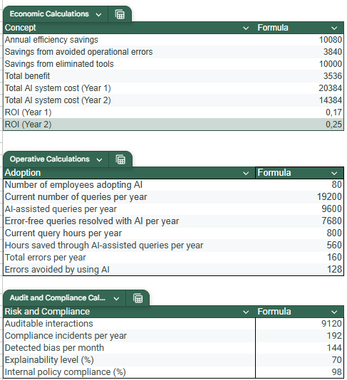

# AI Automation Business Impact – Azure & KPI Model

## Impact of Implementing AI Automation in a 200+ Employee Company
This project analyzes the economic, operational, adoption, and compliance impact derived from implementing an Artificial Intelligence system for internal support and process automation. It includes KPI calculations, a data model, Power BI visualizations, and an executive business-oriented narrative.

##  📊 Dashboard Preview

KPIs

Analysed Data

Calculations

## 📘 Project Objectives
Measure direct economic impact: savings, efficiency, and ROI.

Evaluate the operational improvements generated by AI.

Analyze internal adoption and real usage by employees.

Monitor risks, compliance, and system quality.

Build a professional dashboard in Google Looker Studio for executive reporting.

## KPI Calculation

### 1. Economic KPIs

- ROI: 0.17 (17%)
- Annual Savings: €23.920
- Total Cost: €20.384
- Total Benefit: €3.536

### 2. Operational KPIs

- Time Saved: 560 h/year
- AI-assisted Queries: 9.600/year
- Error-free Queries Rate: 80% (7.680 / 9.600)
- Errors Prevented: 128/year
- Process Automation Rate: 50%

### 3. Adoption KPIs

- Active employees: 200
- Adoption rate: 40%
- Queries per employee per month: 20

### 4. Risk & Compliance KPIs

- Auditable interactions: 98%
- Compliance incidents: 1 per quarter
- Detected biases: 144/year
- Explainability Level: 70%

### 🗂️ Repository Structure

The project currently contains three main components:

1. Data/

Folder containing the dataset used for KPI calculations and dashboard modeling.
This is the source for all economic, operational, adoption, and compliance metrics.

2. Images/

Folder with all dashboard and data‑model images.

Used inside the README to visually document:
- KPIs
- Calculations
- Analysed Data

3. README.md

The main documentation file (the one you are editing right now).

Contains:
- Project description
- Objectives
- KPI definitions
- Dashboard preview images
- Executive narrative

## 📌 Conclusions

The implementation of AI in the company generates:

- Significant annual savings
- ROI of 1.17, justifying the investment
- Reduced operational workload, with hours saved per month
- Solid adoption, with 80 active employees
- Controlled risks, with high traceability and auditability

--
